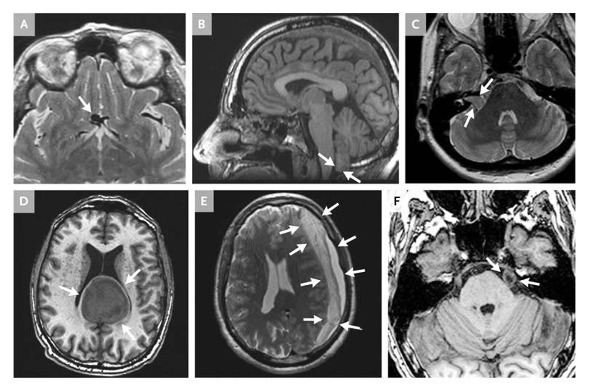

# Level 2 user policies

## General scanning procedures

1. **Booking**

2. **Consenting**

3. **Screening**

4. **Pre-session prep**

5. **Positioning**

6. **Registering a participant**

7. **Scanning**

8. **Incidental findings check:** 
Either during the scan session or after the session has completed, the level 2 user ***must*** check a high-resolution anatomical image (e.g., T1-weighted MPRAGE) for potential incidental findings. [See below for more details](#incidental-findings).

9. **Post-session clean up**
    - **Scanner room**:
    - **Control room**:

10. **Data transfer to echo**
    1. Transfer all data to echo
    2. Ensure that all files were successfully transferred by... (is there a standard method that is used for this? e.g., looking at number of files and total file size on disk? Or perhaps the control computer notes if there are errors in transfer?)

## Incidental findings
Incidental findings are unexpected abnormalities with potential clinical significnace that are discovered during an MRI session and occur relatively frequently. For example, a review of the ABCD dataset found 21% of participants had incidental findings, 4% of which led to a clinical referral ([Li et al., 2021](https://jamanetwork.com/journals/jamaneurology/fullarticle/2777792)). At ToNI, our policy is that level 2 users assume the responsibility of checking for and reporting potential incidential findings for any scan session they are running. This includes sessions for their own projects and sessions they are running for other projects.

### How to check for incidental findings

<figcaption>Vernooij et al., 2007, Fig. 1</figcaption>

### Incidental findings reporting
If you find a potential incidental finding, please email [psy.mri.physicist@utoronto.ca](mailto:psy.mri.physicist@utoronto.ca) with the subject line: "ToNI incidental finding report" and include the study information (i.e., study name, participant ID number, and date) and the image series number containing the potential incidental findings. 

## Control computer disk usage
The control computer has limited disk space for holding recently collected data. The data policy at ToNI is that after data from a scan session has been successfully tranferred to echo, the data on the control computer will remain for 30 days, after which it can be deleted. In this 30 day window, it is the responsibility of each project's users to confirm that the data transferred to echo is complete and without errors.